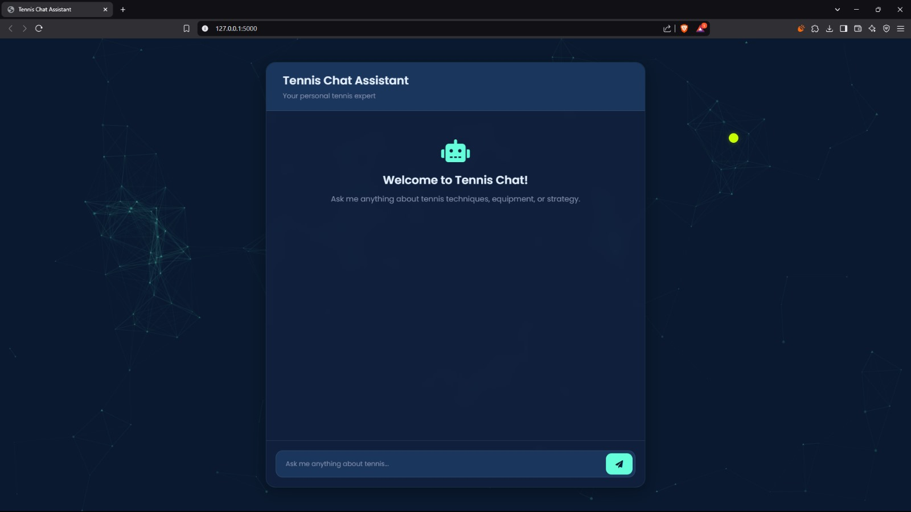

# Tennis AI Chat Assistant

A web-based chat application powered by Flask and OpenAI's GPT-3.5 Turbo that provides expert tennis knowledge and string recommendations.

## Features

- Interactive chat interface with a tennis-focused AI assistant
- Real-time responses using OpenAI's GPT-3.5 Turbo model
- Modern and responsive UI with particle.js background
- Expert knowledge about tennis equipment and strings

## Tech Stack

- **Backend:**
  - Python 3.x
  - Flask (Web Framework)
  - OpenAI API
  - python-dotenv

- **Frontend:**
  - HTML5
  - CSS3
  - JavaScript
  - particles.js (for interactive background)

## Project Structure

```
flask/
├── chat_app.py          # Main Flask application
├── static/
│   ├── css/
│   │   └── style.css    # Custom styling
│   └── js/
│       ├── main.js      # Frontend chat logic
│       └── particles-config.js  # Particle.js configuration
├── templates/
│   └── index.html       # Main chat interface
└── .env                 # Environment variables (not tracked in git)
```

## Setup and Installation

1. Clone the repository
2. Create a virtual environment:
   ```bash
   python -m venv venv
   source venv/bin/activate  # On Windows: venv\Scripts\activate
   ```
3. Install dependencies:
   ```bash
   pip install flask openai python-dotenv
   ```
4. Create a `.env` file in the root directory and add your OpenAI API key:
   ```
   OPENAI_API_KEY=your_api_key_here
   ```

## Running the Application

1. Activate the virtual environment if not already activated
2. Run the Flask application:
   ```bash
   python chat_app.py
   ```
3. Open your browser and navigate to `http://localhost:5000`

## Usage



1. Type your tennis-related question in the chat input
2. Press Enter or click the send button
3. Receive expert responses about tennis equipment, strings, and general tennis knowledge

## Environment Variables

- `OPENAI_API_KEY`: Your OpenAI API key (required)

## Contributing

Feel free to fork the repository and submit pull requests for any improvements.

## License

This project is open source and available under the MIT License.
